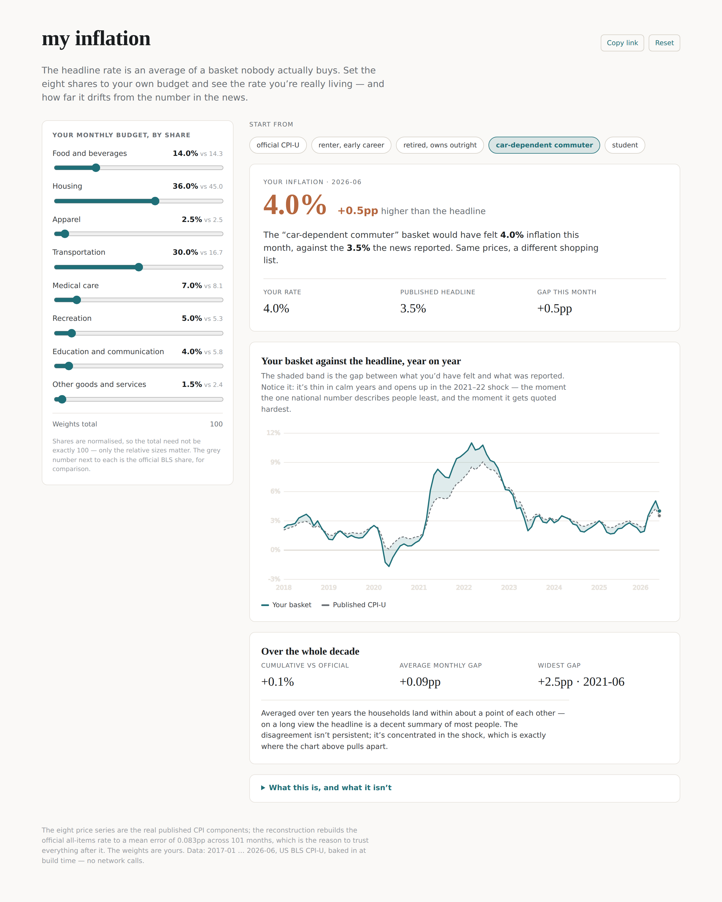
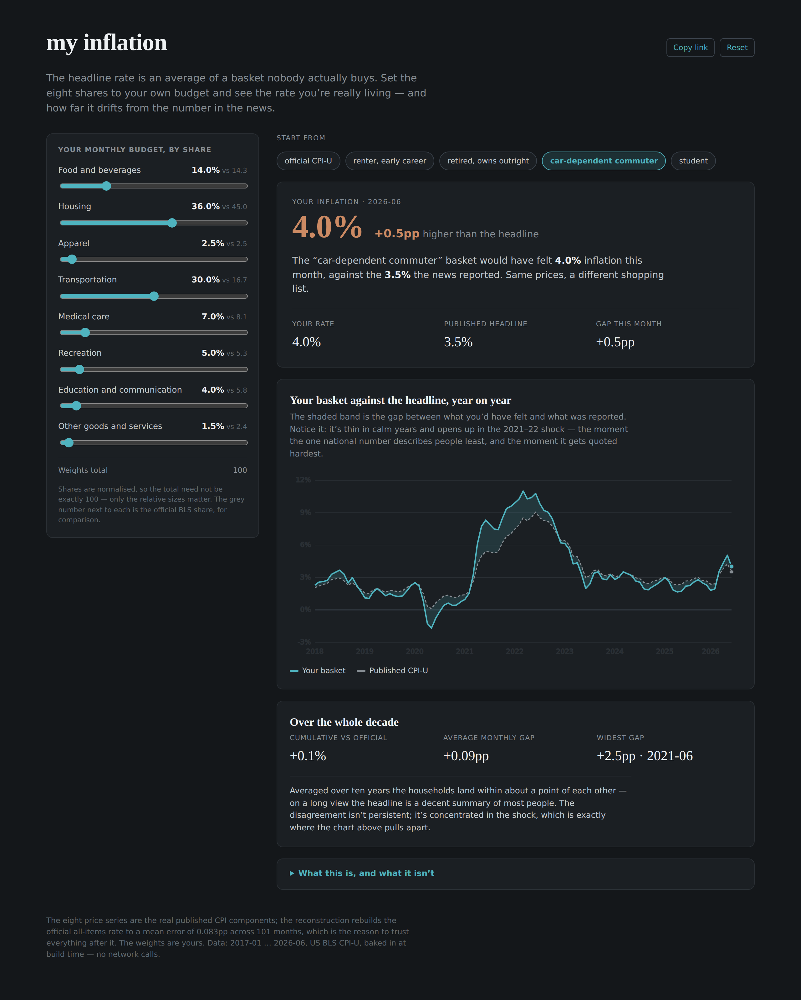

# my-inflation

The news says inflation is 3.5%. Move eight sliders to match how *you*
actually spend, and this shows you the rate you're really living — and how far
it has drifted from the headline. It's the browser version of my
[whose-inflation](https://github.com/finntech3/whose-inflation) analysis: same
data, same reconstruction, but now you build the basket.

**Live calculator:** https://finntech3.github.io/my-inflation/



## The point

Inflation gets reported as one number. That number is an average across
everything people buy, weighted by how much of it they buy — so it describes a
household that spends 45% of its budget on housing, 17% on transport, 8% on
medical care, all at once. Almost nobody has that budget. The average is real,
carefully measured, and describes a composite person who does not exist.

So the honest question isn't "is the 3.5% wrong?" It's "how much does *my*
number differ, and when?" Set your own shares and the answer falls out:

- A **car-dependent commuter** felt about 4.0% last month against the 3.5%
  headline — and back in the 2022 energy spike, felt **11%** while the official
  number said 8.5%.
- A **student** or a **retired owner** runs cooler in a shock, because they
  spend less of their budget on the thing that spiked.

The finding worth taking away, which the ten-year chart makes unavoidable:
**households don't live at persistently different rates — they diverge in a
shock.** Averaged over the decade everyone lands within about a point of the
headline. But when inflation runs above 5%, the gap between baskets is roughly
three times what it is in calm years. The one national number is least
representative at the exact moment it's quoted hardest — in pay talks, benefit
uprating, central-bank press conferences.

## Why you can believe it: the reconstruction comes first

I could have just let you re-weight a basket and drawn a line. That would
produce a chart immediately and prove nothing, because you'd have no way of
knowing the machinery underneath was sound.

So the tool is built on a check it has to pass first. Take the eight published
component indices, weight them by the *official* relative importances, and you
should recover the published all-items rate. It does — to a **mean absolute
error of 0.083 percentage points across 101 months**, against a figure BLS
itself only publishes to one decimal place.

That matters because everything the calculator does afterwards is the same
arithmetic with one table changed — your weights instead of the official ones.
If the official weights hadn't rebuilt the official number, the honest move
would be to stop and find out why, not to ship personal comparisons on a method
that demonstrably doesn't work. There's a test that pins the reconstruction,
and a second one that feeds deliberately wrong weights and asserts the check
*fails* — a verification that can't fail verifies nothing.

The residual error isn't noise. It peaks in 2021, because I use one year's
weights across the whole decade while BLS re-estimates them annually, and the
rebuild drifts most exactly where real spending patterns moved most. A
satisfying kind of error: it has a reason.

## What's here

- `src/lib/cpi.ts` — the CPI index levels and the year-on-year arithmetic.
  Always same-month-a-year-earlier, never month-on-month, because the published
  index isn't seasonally adjusted and consecutive months mostly measure the
  seasons.
- `src/lib/baskets.ts` — the weights, which are the whole argument. The official
  BLS relative importances (exact, sourced) and four illustrative household
  baskets, each with the reasoning next to it.
- `src/lib/inflation.ts` — `basketInflation`, the reconstruction check, and the
  drift comparison. Ported straight from the Python in whose-inflation.
- `src/app/App.tsx` — the one screen: eight sliders, the presets, the live
  headline gap, and the ten-year chart with the shaded band. Presentation only;
  it holds no economics.
- `scripts/build_data.py` — bakes the committed BLS response into a 9 KB JSON
  the app imports, so nothing calls the network at runtime.
- `src/cli/report.ts` — the whole thing as a headless report, for verifying the
  engine without a browser.
- 37 tests, including the two guards that actually matter.

## Running

```
npm install
npm test            # 37 tests, all green
npm run report      # the numbers, headless — try: npm run report 2022-03
npm run dev         # the calculator
npm run build:data  # regenerate src/data/cpi.json from the committed raw pull
```

## The calculator

`npm run dev` runs it locally. One editorial screen: eight sliders on the left,
and on the right your live inflation rate against the headline, the ten-year
chart where your basket and the published CPI cross and diverge, and the
cumulative drift over the whole period. Every slider recomputes everything
instantly — it's a weighted sum of eight numbers, there's nothing to wait for.

The whole basket lives in the URL, so any result is a shareable link: set your
shares, hit **Copy link**, send someone your exact budget. Four **preset
baskets** (a renter, a retired owner, a car commuter, a student) sit above the
answer — they're there to make the point that the verdict flips with the
situation rather than pointing one way forever. Light by default, dark via
`prefers-color-scheme`, no external fonts and no network calls — the engine
runs entirely in the browser, so it deploys as static files with no backend.

<details>
<summary>Dark theme</summary>



</details>

## Decisions and trade-offs

**A weighted sum of group rates, not a chained index.** Over a twelve-month
window these agree closely, because the weights barely move inside a year; over
longer spans the chained calculation is the correct one. The size of the
approximation is not hand-waved — it's exactly the 0.083pp the reconstruction
measures.

**Eight major groups, not the full detail.** The CPI decomposes much further.
Real gaps concentrate in specific items — petrol rather than "transportation",
rent rather than "housing" — and going deeper would sharpen the commuter result
considerably. Eight is the level at which the published relative-importance
table lives, which makes it the level at which the reconstruction can be
*verified*. I'd rather be checkable than sharper-but-unchecked.

**One year's weights across the decade.** BLS re-estimates shares annually; I
apply the December 2023 set throughout. This is the largest simplification, and
it's measurable rather than hypothetical — it's most of the reconstruction
error and it's why that error peaks in 2021.

**The household baskets are illustrative, not measured.** The price data is the
real, published CPI. The preset shares are mine, built by shifting weights in
the directions the Consumer Expenditure Survey documents, and they're labelled
as assumptions everywhere they appear — including in the tool, under "What this
is, and what it isn't". Your own slider settings are exactly that: your
assumption, not a measurement.

**The data is committed, not fetched.** BLS rate-limits the keyless tier hard —
I hit the daily cap while building whose-inflation — so depending on the API at
runtime would make the tool unreproducible and dead on a bad day. The response
is baked into the bundle. Two traps in that feed, handled the same way as in
whose-inflation: a value can be the string `"-"` (a hyphen in a numeric field —
coerce it to zero and you've drawn prices falling 100%), and annual averages
arrive tagged `M13` alongside the monthly rows (treat one as a thirteenth month
and every year gets counted twice). Both are dropped and *counted*, so the
build reports how many it saw — nine hyphens, zero M13s in this pull.

## What it deliberately doesn't claim

- It doesn't measure your spending — it lets you assert it. The output is only
  as good as the shares you set, and the presets are informed guesses, not your
  receipts.
- It's US-only. BLS publishes an API; the UK's ONS retired theirs in November
  2024, which I found out by calling it, so a UK version needs a different data
  path.
- It stops at eight groups, so it will understate a basket whose pain is
  concentrated in one item (a renter, a driver) — the honest cost of staying at
  the level where the number can be checked.

## Tests

37 tests, all offline against the baked data. The two that carry the project:

- **the rebuilt index must match the published one** to within 0.1pp, because
  every other result is that same calculation re-weighted;
- **the household spread must widen with inflation**, because every other test
  would still pass if the baskets quietly became identical — at which point the
  tool would say nothing at all.

Plus one that feeds wrong weights to the verifier and asserts it fails, since a
check that cannot fail is decoration.

## Sources

US Bureau of Labor Statistics, CPI-U, US city average, not seasonally adjusted,
public API v1. Relative importance weights from the CPI news release relative
importance table, December 2023. The raw response is committed under `data/`.

## License

MIT. See [LICENSE](LICENSE).
